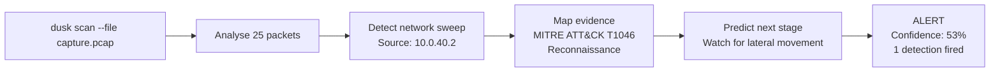

<p align="center">
  
</p>

<p align="center">
  <a href="https://github.com/ShieldTech-Ltd/DUSK/actions/workflows/dusk.yml"></a>
  <a href="LICENSE"></a>
  <a href="https://www.python.org/"></a>
  <a href="https://attack.mitre.org/"></a>
  <a href="https://github.com/ShieldTech-Ltd/DUSK"></a>
</p>

<p align="center">
  <em>Credentials verify identity. DUSK verifies behaviour.</em>
</p>

<p align="center">
  
</p>

---

> **Recent research motivating this work**
>
> [Anthropic Frontier Red Team (3 Jun 2026)](https://www.anthropic.com/research/frontier-red-team-mapping-ai-enabled-cyber-threats) discusses autonomous cyber operations and the limits of existing taxonomies.
>
> [Google DeepMind AI Control Roadmap (18 Jun 2026)](https://deepmind.google/blog/securing-the-future-of-ai-agents/) discusses runtime controls for increasingly capable agents.
>
> These publications motivate DUSK's direction. They are not endorsements or
> independent validation of this project.

---

<details>
<summary><b>Contents</b></summary>

- [The problem](#the-problem)
- [Detection in action](#detection-in-action)
- [OWASP reviewer validation](#owasp-reviewer-validation)
- [What it detects](#what-it-detects)
- [Architecture](#architecture)
- [Optional Superlinked SIE enrichment](#optional-superlinked-sie-enrichment)
- [Quickstart](#quickstart)
- [Roadmap](#roadmap)
- [Governance and security](#governance-and-security)
- [Where DUSK sits](#where-dusk-sits-in-the-enterprise-stack)
- [References](#references)

</details>

---

## The problem

Many established security controls focus on identity, permissions, or known
signatures. AI agents add machine-speed decisions and valid-credential misuse,
which create a need for action-level behavioral monitoring.

An LLM gateway such as AWS Bedrock tells you what an agent is permitted to request. A SIEM such as Microsoft Sentinel tells you what infrastructure events occurred. Neither tells you whether an agent is behaving normally -- or whether it has been compromised mid-task by a prompt injection, a scope drift, or an impersonation.

At agentic scale, that blind spot is where the damage happens:

| Attack | What happens | Why existing controls miss it |
|---|---|---|
| Prompt injection | An agent reads malicious content and overrides its own task | Credentials are valid; each action looks individually legitimate |
| Agent impersonation | A compromised agent feeds false instructions to another as if from the orchestrator | No inter-agent verification or signing |
| Scope creep | An agent with read scope begins writing and deleting | Each permission check passes; only the behavioral pattern is wrong |

DUSK addresses part of this gap and is designed to complement identity,
gateway, network, and SIEM controls.

---

## Detection in action

### Batch gate evaluation

```text
$ dusk gate --baseline tests/fixtures/actions_normal.json \
            --check tests/fixtures/actions_mixed.json

ALLOW       netops-agent   route_change         rt-corp-default         score=0.00 blast=low
ALLOW       iam-agent      role_assignment      ra-iam-readonly         score=0.00 blast=low
ALLOW       segment-agent  segment_change       seg-corporate           score=0.00 blast=low
...
WOULD-BLOCK segment-agent  firewall_rule_change fw-restricted-to-all    score=0.95 blast=high
            ATT&CK T1562.004 Impair Defenses: Disable or Modify System Firewall
            ATLAS  AML.T0051 LLM Prompt Injection
            reason action type 'firewall_rule_change' is new for this agent
            next   expect lateral movement into the newly reachable segment
WOULD-BLOCK iam-agent      role_assignment      ra-iam-owner-self       score=0.80 blast=high
            ATT&CK T1098 Account Manipulation
            ATLAS  AML.T0051 LLM Prompt Injection
            reason newly introduces sensitive or privileged terms ['owner', 'self']
            next   expect privilege use; watch for actions the new role permits

GATE evaluated 18 action(s), refused 3.
```

The gate scores 1.0 precision, 1.0 recall, and 0.0 false-positive rate on the bundled benchmark (`test_benchmark_precision_recall`).

## OWASP reviewer validation

The DUSK Production Agent Harness includes a keyless reviewer scenario with a
mock agent, the real DUSK HTTP gate, and a mock downstream target on a
localhost-only Docker network. It needs no credential, paid service, model
download, or production system. Authenticated real LLM validation is a separate
protected workflow.

```bash
cd dusk-agent-harness
./scripts/run_owasp_demo.sh watch
./scripts/run_owasp_demo.sh enforce
```

The script fails unless watch mode produces `ALLOW` and `WOULD-BLOCK`, enforce
mode produces `ALLOW` and `BLOCK`, and only the expected actions reach the
downstream target. See the
[demo recording guide](docs/owasp-demo-recording.md) and the
[accepted Superlinked example](https://github.com/superlinked/sie/tree/main/examples/agent-action-monitor).

The signed [v0.2.0 release](https://github.com/ShieldTech-Ltd/DUSK/releases/tag/v0.2.0)
contains the wheel, source archive, SBOM, checksums, and build provenance. The
[90-second reviewer recording](https://github.com/ShieldTech-Ltd/DUSK/releases/download/v0.2.0/dusk-owasp-demo-v0.2.0.mp4)
shows both modes from that release. This is an Incubator demonstration, not
evidence that DUSK is ready for an untrusted or production deployment.

### Network sweep detection



---

## What it detects

| Detection | Behavior | MITRE | Layer | Status |
|---|---|---|---|---|
| Prompt injection via behavioral drift | Agent's actions diverge from its own normal pattern after reading external content | AML.T0051 + T1562.004 | Control plane | Shipped |
| Privilege escalation | Agent introduces sensitive roles or access values it has never used | T1098 | Control plane | Shipped |
| Scope creep | Agent performs a verb category it has never used before | T1078 | Control plane | Shipped |
| Network sweep | Machine-paced scan across many destinations | T1046 | Data plane | Shipped |
| Boundary probe | Port scan against a single destination | T1590 | Data plane | Shipped |

Each detection returns a confidence or anomaly score, blast radius estimate, MITRE ATT&CK and ATLAS mappings, and a prediction of the attacker's next move.

---

## How it works

**Behavioral baseline.** DUSK learns what each individual agent normally does: which action types it performs, which target classes it touches, which tokens and change values it introduces. This is per-agent, not per-role.

**Anomaly scoring.** When a new action arrives, DUSK computes a weighted anomaly score across novelty signals: new action type, new target class, new tokens, new change values, and newly introduced sensitive terms. Weights are explicit; the computation is deterministic and dependency-free.

**Verdict rendering.** Actions above the configured threshold receive ALLOW, WOULD-BLOCK, or BLOCK with full reasoning, MITRE mappings, blast radius, and a prediction of what an attacker would do next. Watch mode never blocks; enforce mode upgrades WOULD-BLOCK to BLOCK once the baseline is trusted.

### Decision evidence

<p align="center">
  
</p>

---

## Architecture

### Current gate implementation

<p align="center">
  
</p>

This is the implemented boundary of the self-contained HTTP gate example. It
does not imply a vector database, policy repository, SIEM, cloud platform, or
human-review service.

### Attack flow

<p align="center">
  
</p>

<p align="center"><sub>The visual keeps all three moments visible: a routine action follows the established pattern, prompt injection changes the action when no behavioral gate is present, and DUSK intercepts the same anomaly before execution. Animated paths preserve the sense of movement without hiding the comparison.</sub></p>

For the full layered design and integration notes, see [docs/ARCHITECTURE.md](docs/ARCHITECTURE.md).

---

## Where DUSK sits in the enterprise stack

| Platform | Layer | Covers | Leaves open |
|---|---|---|---|
| AWS Bedrock | LLM gateway | Access control and audit for model calls | No baseline of an agent's downstream behavior |
| A SIEM (e.g. Microsoft Sentinel) | Infrastructure detection | Log-based analytics, known-bad signatures | No per-agent action baseline at the control plane |
| Cisco and network tooling | Network | Traffic flows at OSI layers 3 to 7 | No agent or action context |
| Google DeepMind agent security | Research | Frameworks for controlling agents | A research direction, not a deployable control |
| Superlinked SIE | Inference engine | Embedding, rerank, and extraction primitives | Not a detection policy on its own -- DUSK is what wires it into one |
| **DUSK** | **Control plane + network** | **Per-agent behavioral monitoring of actions** | **The gap the others leave** |

### Why not SIEM or access control?

Every tool above asks one question: **is this agent allowed to do this?** DUSK asks a different question: **does this agent normally do this?** Those are not the same question, and they have different answers when an agent is compromised.

A prompt-injected agent has valid credentials. Its token has not changed. The LLM gateway sees a permitted request. The SIEM sees a permitted API call. Every authorization check passes -- because the agent is who it says it is, it just no longer wants what it used to want.

SIEM rules fire on known-bad signatures. A behavioral baseline fires on anything that deviates from known-good, whether or not the attacker's technique has been seen before.

**Credentials verify identity. DUSK verifies behaviour.**

---

## Optional Superlinked SIE enrichment

The agent action gate is also shipped as a self-contained HTTP service
(`POST /v1/gate`) inside the
[DUSK Production Agent Harness](dusk-agent-harness/README.md).
[Superlinked SIE](https://github.com/superlinked/sie) can optionally enrich
behavioral similarity through encode, score, and extract operations. Every SIE
signal is additive to the deterministic core, so the default local stack needs
no SIE runtime or outbound model download.

```bash
cd dusk-agent-harness
docker compose up

curl -X POST http://localhost:8000/v1/gate \
  -H "Content-Type: application/json" \
  -d '{"agent_id": "netops-agent", "timestamp": "2023-11-14T22:20:00+00:00",
       "action_type": "firewall_rule_change", "target": "fw-corp-https",
       "change": {"before": null, "after": {"port": 443}}, "source": "generic"}'
```

The full runnable harness includes the gate service, a local
webhook sink, a mock downstream target, and a Bedrock-or-mock agent runtime. An
importable n8n workflow remains available for operators who provide a separately
maintained n8n deployment. The DUSK Production Agent Harness lives entirely at
[`dusk-agent-harness/`](dusk-agent-harness/README.md).
This root package does not run `/v1/gate`; its `dusk gate` CLI command evaluates
a batch of actions offline instead.

---

## Cloudflare Edge Demo

A controlled Cloudflare edge demo for DUSK action authorization.
It is not a production deployment or a guarantee of agent safety.

The demo enforces two scenarios end-to-end through a Cloudflare Worker backed by a
loopback Python policy service:

| Action | risk_signal | Result |
|--------|-------------|--------|
| `demo.read_status` | `normal` | ALLOWED, executed: true |
| `demo.rotate_demo_key` | `prompt_injection` | BLOCKED, executed: false |

Source: [`cloudflare-demo/`](cloudflare-demo/) and [`src/dusk/demo_cloudflare.py`](src/dusk/demo_cloudflare.py).
Full local run guide: [`docs/cloudflare-edge-demo.md`](docs/cloudflare-edge-demo.md).

---


## Quickstart

```bash
git clone https://github.com/ShieldTech-Ltd/DUSK.git
cd DUSK
pip install -e ".[dev]"

# Gate a batch of actions
dusk gate --baseline tests/fixtures/actions_normal.json \
          --check tests/fixtures/actions_mixed.json

# Scan a packet capture
dusk scan --file tests/fixtures/attack_sweep.pcap
```

---

## Usage

```text
dusk --help
dusk --version

# Control-plane gate
dusk gate --baseline <known-good.json> --check <to-evaluate.json>
dusk gate --baseline <path> --check <path> --enforce   # block instead of warn
dusk gate --baseline <path> --check <path> --json      # machine-readable output

# Agent action ingest
dusk actions --file <actions.json> --source <name>
dusk actions --file <path> --source azure --json

# Network layer
dusk scan --file <capture.pcap>
dusk scan --file <path> --json
dusk watch --interface <iface>      # live capture (planned for v0.3)
```

`--verbose` raises the root logger to DEBUG and writes structured log lines to stderr, keeping machine output on stdout clean.

---

## JSON output

`dusk gate --json` prints a stable machine-readable document. One entry appears per evaluated action.

```json
{
  "baseline": "tests/fixtures/actions_normal.json",
  "check": "tests/fixtures/actions_mixed.json",
  "actions_evaluated": 18,
  "refused": 3,
  "results": [
    {
      "verdict": "ALLOW",
      "refused": false,
      "analysis": {
        "agent_id": "netops-agent",
        "action_type": "route_change",
        "target": "rt-corp-default",
        "score": 0.0,
        "reasons": ["action matches the agent's established pattern"],
        "mitre_attack": "T1078 Valid Accounts",
        "mitre_atlas": "AML.T0051 LLM Prompt Injection",
        "blast_radius": "low",
        "predicted_next": "watch this agent for further actions outside its established pattern"
      }
    }
  ]
}
```

On an input error the document is `{"error": "..."}` and the exit code is 2.

---

## Exit codes

| Code | Meaning |
|---|---|
| 0 | Clean -- no action refused (gate), or no detection fired (scan) |
| 1 | Alert -- at least one action refused or one detection fired |
| 2 | Input error -- missing, empty, or unreadable file |

---

## Configuration

All thresholds are configurable. Copy `dusk.yaml.example` to `dusk.yaml` in your working directory, or override any value with a `DUSK_*` environment variable.

| Setting | Default | Environment variable |
|---|---|---|
| Gate block threshold | 0.6 | `DUSK_GATE_BLOCK_THRESHOLD` |
| Sweep threshold (unique destinations) | 15 | `DUSK_SWEEP_THRESHOLD` |
| Sweep window in seconds | 10.0 | `DUSK_SWEEP_WINDOW_SECONDS` |
| Sweep timing std threshold | 0.05 | `DUSK_SWEEP_TIMING_STD_THRESHOLD` |
| Boundary port threshold | 10 | `DUSK_BOUNDARY_PORT_THRESHOLD` |
| Boundary window in seconds | 30.0 | `DUSK_BOUNDARY_WINDOW_SECONDS` |
| Alert log path | dusk-alerts.json | `DUSK_ALERT_LOG_PATH` |
| Log level | WARNING | `DUSK_LOG_LEVEL` |

---

## Project layout

```text
src/dusk/
  cli.py                Command-line interface (Click): scan, watch, actions, gate
  config.py             Configuration: defaults, dusk.yaml, DUSK_* env vars
  actions/
    event.py            AgentAction canonical event schema
    adapters/           Source-specific adapters (azure, bedrock, generic)
    normaliser.py       Adapter registry keyed by source name
    ingest.py           ingest_file: reads JSON, normalises, skips malformed
    baseline.py         Per-agent behavioral baseline (learn, observe, profile)
    analyse.py          Anomaly scoring, blast radius, MITRE mapping, next-stage prediction
    verdict.py          ALLOW / WOULD-BLOCK / BLOCK rendering (ActionGate)
    heal.py             AgentHealer: quarantine, baseline reset
  core/
    engine.py           Detection runner and verdict
    kill_chain.py       Kill-chain stage prediction
  detections/           One module per network behavioral detection
  sensor/               Traffic sources (pcap; live and Zeek next)
  respond/              Responders (alert log; isolation next)
  trace/                Superlinked SIE client (vector.py) + trace models, offline CLI path
dusk-agent-harness/  DUSK Production Agent Harness with its own package, gate
                     API, webhook client, hardened Docker stack, agent runtime,
                     mock target, contract, and optional n8n workflow asset.
lab/
  actions/              Action fixture generators (normal + out-of-pattern)
  scenarios/            pcap generators for network fixture data
tests/                  Unit, edge-case, benchmark, and end-to-end tests
docs/                   Architecture, threat model, and operational docs
```

---

## Development

```bash
pip install -e ".[dev]"
pre-commit install

# Individual checks (all run in CI)
ruff check src/ tests/
ruff format --check src/ tests/
mypy src/dusk/
bandit -r src/ -ll
pip-audit -r requirements.txt
pytest --cov=src/dusk --cov-report=term-missing
```

CI runs on every push and pull request to `dev` and `main`. The aggregate
`security-gate` requires code-quality, vulnerability, contract, container, and
authenticated sandbox checks to succeed before merge. Slower full-history and
fresh-container scans run on a separate schedule. See the
[CI/CD security gates](docs/ci-security.md) for the exact evidence, local
commands, performance design, and release boundary.

## Governance and security

The repository's merge, deep-security, container, and release guarantees are defined by the
[100-control enterprise CI catalogue](docs/ci-controls.md). Branch protection needs only the
fail-closed `security-gate` status.

DUSK is preparing for an OWASP Incubator application as a tool project. It does
not claim complete OWASP Agentic Top 10 coverage or product
certification. The exact shipped, partial, planned, and out-of-scope mappings
are documented in [the threat model](docs/threat-model.md).

- [Governance and proposed project leaders](GOVERNANCE.md)
- [Contribution and DCO requirements](CONTRIBUTING.md)
- [Security policy](SECURITY.md)
- [Production hardening](docs/production-hardening.md)
- [Security self-assessment](docs/security-self-assessment.md)
- [CI/CD security gates](docs/ci-security.md)
- [OWASP Incubator proposal](docs/owasp-project-proposal.md)
- [OWASP application submission package](docs/owasp-application.md)
- [OWASP application readiness tracker](docs/owasp-readiness-tracker.md)
- [GitHub administrator settings for OWASP readiness](docs/github-owasp-settings.md)
- [OWASP technical evidence manifest](docs/owasp-technical-evidence.json)
- [Documentation license](LICENSE-docs.md)

---

## Roadmap

### Shipped

| Layer | What it does | Status |
|---|---|---|
| v0.1 | Sweep (T1046) and boundary probe (T1590) over packet captures | Implemented, historical release not published |
| v0.2 | Action ingest, per-agent baseline, deterministic analysis, verdict gate, healing workflow, and optional SIE-enriched HTTP example | Released |

### In progress

| Layer | What it does |
|---|---|
| v0.3 | Telemetry silence and lateral movement detection, plus stronger data-plane confirmation |

### Direction

| Layer | What it does |
|---|---|
| Future reasoning layer | Inspect agent decision and tool-call reasoning to catch intent before the action is formed |
| Future isolation | Automated containment with durable, externally enforced quarantine and preserved audit evidence |

DUSK ships in watch mode first. An inline gate that wrongly blocks a legitimate action can disrupt a network, so the gate observes and reports until its baseline is trusted in a given environment.

---

## References

- [Anthropic Frontier Red Team: Mapping AI-enabled cyber threats](https://www.anthropic.com/research/frontier-red-team-mapping-ai-enabled-cyber-threats) -- 832 threat actors analysed; autonomous killchain orchestration identified as highest-risk AI threat with no existing MITRE taxonomy
- [Google DeepMind: securing AI agents](https://deepmind.google/blog/securing-the-future-of-ai-agents/) -- the case for behavior-level controls on agents
- [MITRE ATT&CK](https://attack.mitre.org/) -- enterprise and network techniques
- [MITRE ATLAS](https://atlas.mitre.org/) -- adversarial threats to AI systems
- [Superlinked SIE](https://github.com/superlinked/sie) -- self-hosted inference engine powering the gate service's encode, score, and extract primitives (see [optional Superlinked SIE enrichment](#optional-superlinked-sie-enrichment) above)
- [n8n](https://n8n.io/) -- optional external workflow automation target for the three named webhooks
- [OWASP Top 10 for Agentic Applications 2026](https://genai.owasp.org/resource/owasp-top-10-for-agentic-applications-for-2026/) -- canonical agentic risk taxonomy
- Threat model and MITRE mappings: [docs/threat-model.md](docs/threat-model.md)

---

## License

Code is Apache-2.0. Documentation is CC BY-SA 4.0. See [LICENSE](LICENSE) and
[LICENSE-docs.md](LICENSE-docs.md) for details.

---

<p align="center">
  Maintained by <a href="https://linkedin.com/in/tanvir-farhad-466940307">Tanvir Farhad</a> and <a href="https://github.com/ritiksah141">Ritik Sah</a>
</p>
