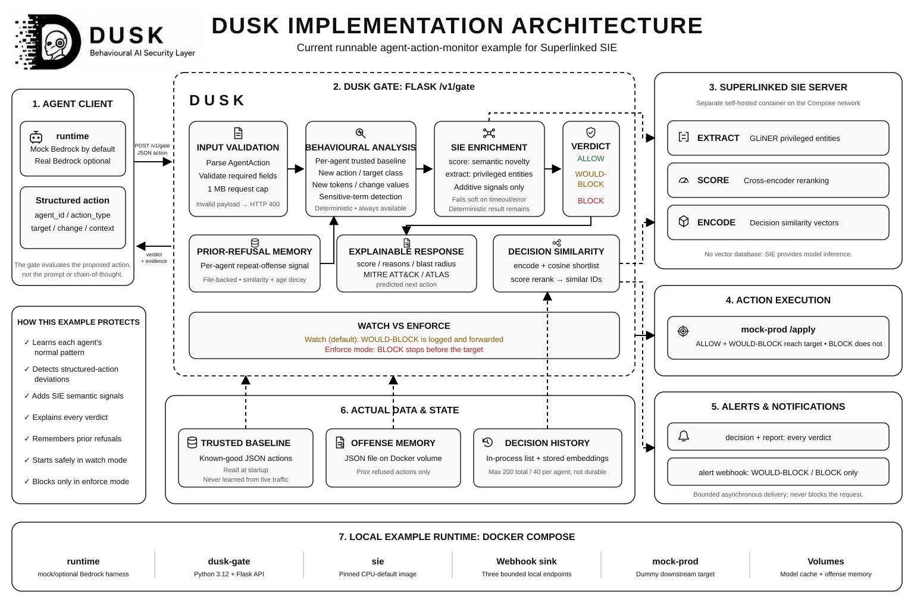

# DUSK architecture

DUSK has two implemented evaluation paths: an offline root package and a
self-contained DUSK Production Agent Harness. Both consume the same canonical agent-action
shape and apply per-agent behavioural analysis, but they have deliberately
different deployment boundaries.

The proposed production control-plane service is intentionally a third, separate
boundary. Its reviewed design is recorded in
[ADR 0001](adr/0001-production-control-plane.md). It is not described as an
implemented capability until the corresponding production issues land.

## Current gate implementation

The diagram represents the runnable `dusk-agent-harness` stack. It
does not imply a vector database, policy repository, SIEM, cloud platform, or
human-review service.

## Root package

- Actions (`dusk.actions`) normalise Azure, Bedrock, and generic records into a
  canonical `AgentAction`, learn a trusted per-agent baseline, calculate an
  anomaly score, and render `ALLOW`, `WOULD-BLOCK`, or `BLOCK`.
- Sensors (`dusk.sensor`) normalise pcap, live-capture, and Zeek inputs for the
  packet-detection path.
- Detections (`dusk.detections`) evaluate network sweep, boundary, lateral, and
  telemetry signals.
- Responders (`dusk.respond`) turn findings into alerts or isolation actions.
- The root `dusk gate` command evaluates action files offline. It does not host
  `/v1/gate`.

## DUSK Production Agent Harness

`dusk-agent-harness` owns the Flask `/v1/gate` service, Docker
Compose stack, trusted sample baseline, prior-refusal memory, bounded in-process
decision history, outbound webhooks, agent harness, and mock downstream target.

Superlinked SIE is a separate inference service. `score` and `extract` add
semantic novelty and privileged-entity signals to behavioural analysis;
`encode` and `score` power similar-decision lookup. All model-derived signals
fail soft, leaving the deterministic result available.

## Decision and execution flow

1. A client submits a structured `AgentAction`.
2. DUSK validates it and compares it with that agent's trusted baseline.
3. Optional SIE signals and prior-refusal memory add evidence.
4. The configured threshold produces an explainable verdict.
5. Watch mode returns `WOULD-BLOCK` but forwards the action. Enforce mode
   returns `BLOCK` and prevents the client from calling the target.
6. Decision and report webhooks fire for every verdict; alerts fire only for
   refused verdicts.

The trusted baseline is never updated from live requests, which prevents an
attacker from slowly teaching malicious behavior as normal.

## Related documentation

- [Agent-action schema](action-schema.md)
- [Production harness walkthrough](agent-demo-walkthrough.md)
- [SIE primitives](sie-primitives.md)
- [Gate Docker verification](gate-docker-verification.md)
- [Gate latency notes](gate-latency-notes.md)
- [Threat model](threat-model.md)
- [Production control-plane threat model](production-control-plane-threat-model.md)
- [Control-plane API conventions](control-plane-api-conventions.md)
